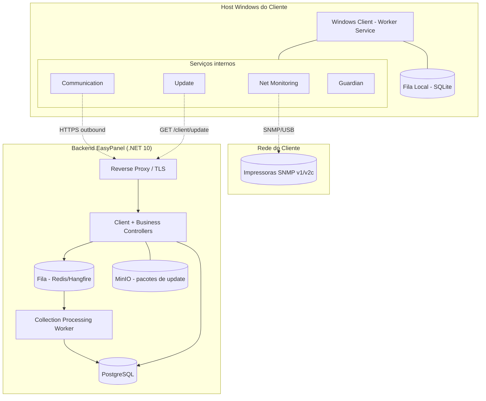
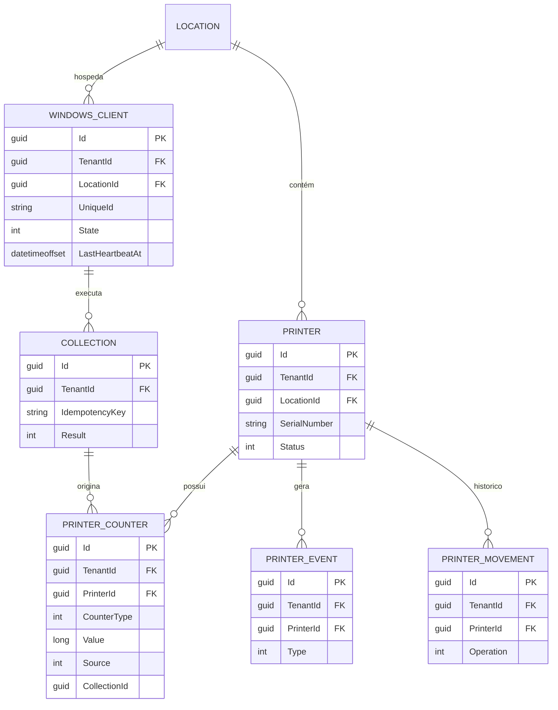

# Design Document — EasyPanel (FASE 2: Monitoramento)

## Overview

Este documento descreve o design técnico da **Fase 2** do EasyPanel: o agente **Windows Client**, os **endpoints de backend do cliente**, as **entidades de negócio** de monitoramento (Windows_Client, Impressora, PrinterCounter, PrinterEvent, Coleta, Histórico de Movimentação) e o **pipeline de ingestão assíncrono** com idempotência.

A Fase 2 **constrói sobre a Fase 1** (spec `easypanel-print-outsourcing-platform`), reutilizando: monólito modular, isolamento multi-tenant (query filters globais + interceptor de escrita), ASP.NET Identity/JWT/RBAC, AuditLog append-only, rate limiting, ProblemDetails, `Result`/`PagedResult`, e a stack de infraestrutura (PostgreSQL, Redis, MinIO, OpenTelemetry/Serilog). Nenhum desses elementos é redefinido; são premissas.

### Mapeamento de requisitos para componentes

| Requisito | Componente(s) principal(is) |
|-----------|-----------------------------|
| R1 Ciclo de vida do agente | `EasyPanel.WindowsClient` (Worker Service), instalador, mutex de instância única |
| R2 Serviços internos + Guardian | Net/Communication/Update/Guardian services no agente |
| R3 Registro do agente | `ClientRegistrationController`, `IClientRegistrationService`, entidade `WindowsClient` |
| R4 Autenticação do agente | `IClientAuthService`, esquema de auth `ClientBearer`, `ClientCredential`/`ClientToken` |
| R5 Comunicação segura + offline | `CommunicationService` + `LocalQueue` (SQLite) no agente |
| R6 Heartbeat | `ClientController.Heartbeat`, `IHeartbeatService`, `HeartbeatMonitor` (worker) |
| R7 Descoberta | `NetMonitoringService` (agente) + ingestão de candidatas |
| R8 SNMP + drivers | `ISnmpCollector`, `IPrinterDriver` + implementações por fabricante |
| R9 Cadastro de impressoras | `PrintersController`, `IPrinterService`, entidade `Printer` |
| R10 Movimentação/ciclo de vida | `IPrinterService` + `PrinterMovement` (append-only) |
| R11 Contadores | `ICounterService`, entidade `PrinterCounter`, validação de não-decréscimo |
| R12 Coletas + falhas | `IIngestionService`, entidade `Collection`, `PrinterEvent` |
| R13 Idempotência | `IdempotencyKey` único + tabela de deduplicação |
| R14 Pipeline assíncrono | Fila (Redis/Hangfire) + `CollectionProcessingWorker` |
| R15 Configuração do agente | `ClientController.Config`, `IClientConfigService` |
| R16 Auto-update | `ClientController.Update`, `IClientUpdateService`, MinIO para pacotes |
| R17 RBAC/escala/segurança | Novas permissões, rate limiting por client, DTOs, índices |

## Architecture

### Visão de alto nível



**Fluxo principal (R14):** CLIENT → API (ingestão, idempotência) → FILA → WORKER → PROCESSAMENTO → DB → PrinterEvents. O agente nunca abre portas de entrada; toda comunicação é HTTPS de saída (R5.1).

### Estrutura de solução (novos projetos)

```
src/
├── EasyPanel.Modules.Monitoring/      # NOVO — contratos: WindowsClient, Printer,
│                                       #   PrinterCounter, PrinterEvent, Collection,
│                                       #   PrinterMovement; I*Service; drivers (IPrinterDriver)
├── EasyPanel.Infrastructure/          # + configs EF, migrações, serviços de monitoramento,
│                                       #   esquema de auth do cliente, fila/worker
├── EasyPanel.Api/                     # + Client/Printers/Counters controllers, DI
├── EasyPanel.Workers/                 # NOVO — host de workers (Hangfire) para processamento
└── windows-client/
    ├── EasyPanel.WindowsClient/        # NOVO — Worker Service (.NET 10): Guardian +
    │                                   #   Net/Communication/Update services, fila SQLite
    └── EasyPanel.WindowsClient.Snmp/   # NOVO — coleta SNMP + IPrinterDriver por fabricante
```

Regra de dependência preservada: `Api`/`Workers` → `Modules.*` → `Shared.Kernel`; `Infrastructure` implementa abstrações. O Windows Client é uma solução-satélite independente que consome apenas a API HTTP (não referencia o backend).

## Components and Interfaces

### 1. Autenticação própria do cliente (R3, R4)

Distinta dos JWT de usuário. Um `WindowsClient` recebe, no registro, uma **credencial de cliente** (client_id + client_secret opaco, armazenado hasheado) e passa a autenticar-se para obter um **token de acesso de curta duração** (≤ 15 min) + credencial de renovação.

```csharp
public class WindowsClient : TenantEntity
{
    public Guid CustomerId { get; set; }
    public Guid LocationId { get; set; }
    public string UniqueId { get; set; }        // identificador estável do agente (R3.1)
    public string Hostname { get; set; }
    public string AgentVersion { get; set; }
    public WindowsClientState State { get; set; } // Registered, Active, HeartbeatMissing, Disabled
    public DateTimeOffset? LastHeartbeatAt { get; set; }
    public DateTimeOffset? LastCollectionAt { get; set; }
    public string SecretHash { get; set; }        // hash da credencial do cliente
}

public interface IClientAuthService
{
    Task<Result<ClientTokenPair>> AuthenticateAsync(string clientId, string clientSecret, CancellationToken ct);
    Task<Result<ClientTokenPair>> RefreshAsync(string refreshToken, CancellationToken ct);
}
```

- **Esquema de autenticação `ClientBearer`:** um segundo `AuthenticationScheme` no backend valida o token do cliente e popula um `IClientContext` (ClientId, TenantId, LocationId) scoped, análogo ao `ITenantContext`. O tenant/local são resolvidos **da identidade do cliente**, nunca da requisição (R4.2). Tentativa de acesso a outro tenant/local → 404 (R4.6).
- Endpoints `/api/v1/client/*` exigem o esquema `ClientBearer`; endpoints de negócio (`/api/v1/printers`, `/counters`, `/clients`) exigem JWT de usuário + permissões RBAC.
- **Decisão:** reaproveitar o `ITokenService` para assinar tokens do cliente com um `audience` dedicado (`easypanel:client`), isolando-os dos tokens de usuário.

### 2. Registro e heartbeat (R3, R6)

- `POST /api/v1/client/register` — autenticado por uma **credencial de registro** (chave de provisionamento emitida no onboarding do Local, associada a Tenant+Local). Cria o `WindowsClient`, emite as credenciais próprias (R3.4) e audita (R3.6).
- `POST /api/v1/client/heartbeat` — a cada 60s (R6.1); atualiza `LastHeartbeatAt`/`State`.
- **`HeartbeatMonitor` (worker periódico):** varre `WindowsClient`s cujo `LastHeartbeatAt` excede o limite configurável e marca `HeartbeatMissing`, gerando um `PrinterEvent` de heartbeat ausente para a Fase 3 consumir (R6.4). Ao voltar heartbeat, restaura `Active` (R6.5).

### 3. Ingestão, idempotência e pipeline assíncrono (R12, R13, R14)

```csharp
public interface IIngestionService
{
    Task<Result<IngestionAck>> SubmitCollectionAsync(ClientCollectionSubmission submission, CancellationToken ct);
}
```

- `POST /api/v1/client/collect` e `/upload` exigem uma **`IdempotencyKey`** por submissão (R13.1). Uma tabela `IngestionDedup (TenantId, IdempotencyKey)` única registra chaves processadas; chave repetida → resposta de sucesso equivalente sem recriar dados (R13.3/R13.4).
- A submissão válida é **enfileirada** (Hangfire sobre Redis) e a API retorna imediatamente (R14.1). O `CollectionProcessingWorker` consome, persiste `PrinterCounter`s, atualiza status da `Printer` e grava `PrinterEvent`s em **operação atômica** que preserva a idempotência (R14.4). Retry com backoff sem descartar antes de esgotar tentativas (R14.3).

**Decisão — Hangfire:** provisionado desde a Fase 1, agora exercitado como a fila/worker de processamento. Alternativa (canal in-process) rejeitada por não sobreviver a reinícios nem escalar horizontalmente.

### 4. Impressoras, movimentação e contadores (R9, R10, R11)

- `Printer : TenantEntity` com os campos de R9.1 e `PrinterStatus { Online, Offline, Unknown, Disabled, NoCommunication }`. Query filter global + interceptor herdados garantem isolamento e cross-tenant → 404.
- **Movimentação (R10):** `PrinterMovement : BaseEntity` (append-only) registra instalar/transferir/recolher/desabilitar/reativar com Local origem/destino, ator e horário. Transferência atualiza o Local vigente preservando o histórico.
- **Contadores (R11):** `PrinterCounter` append-only; validação de **não-decréscimo** por (Impressora, tipo) — leitura menor que a última é rejeitada, salvo **ajuste administrativo** auditado (ator, valor anterior/novo, justificativa — R11.6). Consulta por **cursor pagination** (R11.7) para milhões de registros.

### 5. Windows Client (R1, R2, R5, R7, R8, R15, R16)

Worker Service .NET 10 com quatro serviços internos supervisionados pelo **Guardian** (R2). Instância única via named mutex (R1.5); instalação silenciosa/GPO (R1.3/R1.4); auto-recovery do Windows Service (R1.2).

- **Net Monitoring (R7, R8):** descoberta por IP/faixa/subnet/broadcast/SNMP/USB; coleta SNMP v1/v2c via `ISnmpCollector`, interpretada por `IPrinterDriver` (HP, Canon, Epson, Brother, Kyocera, Xerox, Ricoh, Konica, Lexmark). Especificidades de fabricante ficam **só** nos drivers; núcleo agnóstico e extensível; arquitetura preparada para SNMP v3 sem redesenho (R8.6).
- **Communication (R5):** HTTPS de saída, validação de certificado TLS; `LocalQueue` (SQLite) persiste coletas quando o backend está inacessível e reenvia com backoff ao restabelecer (R5.4–R5.6). Credenciais/tokens/SNMP nunca vão para logs (R5.7/R8.7).
- **Update (R16):** `GET /api/v1/client/update` retorna versão + localização (MinIO) + hash/assinatura; o pacote é validado (assinatura + hash) antes de aplicar; falha de inicialização → rollback (R16.4).
- **Config (R15):** `GET /api/v1/client/config` retorna intervalo de coleta, alvos de descoberta e impressoras ignoradas; fallback para a última config válida em caso de falha.

```csharp
public interface IPrinterDriver
{
    string Manufacturer { get; }
    bool CanHandle(SnmpDeviceProbe probe);
    PrinterReading Interpret(SnmpQueryResult snmp);   // normaliza OIDs → atributos
}
```

## Data Models

### Modelo ER (Fase 2, sobre a Fase 1)



### Índices principais (R17.7)

| Tabela | Índice | Motivo |
|--------|--------|--------|
| WindowsClient | `(TenantId, LocationId)`, `UNIQUE (TenantId, UniqueId)`, `(TenantId, State)` | isolamento, unicidade do agente, varredura de heartbeat |
| Printer | `(TenantId, LocationId)`, `(TenantId, Status)`, `(TenantId, SerialNumber)`, `(TenantId, Patrimonio)` | filtros/busca do parque |
| PrinterCounter | `(TenantId, PrinterId, CounterType, Timestamp)` | cursor pagination + não-decréscimo |
| PrinterEvent | `(TenantId, PrinterId, OccurredAt DESC)`, `(TenantId, Type)` | consumo pela Fase 3 |
| Collection | `UNIQUE (TenantId, IdempotencyKey)`, `(TenantId, WindowsClientId)` | idempotência (R13) |
| IngestionDedup | `UNIQUE (TenantId, IdempotencyKey)` | deduplicação rápida |

Cursor pagination usa `(Timestamp, Id)` como chave estável, evitando OFFSET custoso.

## Error Handling

Reutiliza o `ExceptionHandlingMiddleware` da Fase 1 (ProblemDetails). Adições:

| Situação | HTTP | Nota |
|----------|------|------|
| Token de cliente ausente/inválido/expirado | 401 | esquema ClientBearer (R4.3) |
| Cliente acessa outro tenant/local | 404 | não-vazamento (R4.6) |
| Contador decrescente sem ajuste | 400/409 | decréscimo inválido (R11.5) |
| Idempotência duplicada | 200 | ack equivalente ao original (R13.4) |
| Rate limit do cliente excedido | 429 | por client + endpoint (R17.4) |

## Testing Strategy

- **Unit:** validação de não-decréscimo de contador; idempotência (deduplicação); resolução de tenant/local pela identidade do cliente; seleção de `IPrinterDriver` por probe; política de retry/backoff.
- **Integration (Testcontainers/SQLite):** registro→auth→heartbeat→collect→processamento persistindo contadores; reenvio idempotente não duplica; heartbeat ausente gera PrinterEvent; movimentação preserva histórico; cursor pagination.
- **Security/Multi-tenant:** cliente do Tenant A não acessa impressoras/coletas do Tenant B (→404); credenciais/SNMP nunca aparecem em logs; endpoints do cliente respeitam rate limit.
- **Windows Client:** testes do Guardian (reinício de serviço parado), da fila local (persistência offline + reenvio), e da validação de assinatura/hash de update (com rollback simulado).

## Correctness Properties

#### Property 1: Origem do tenant/local do cliente
O tenant_id e o Local de qualquer requisição do Windows_Client derivam sempre da identidade autenticada do cliente, nunca de valores da requisição. (R4.2, R4.6)

#### Property 2: Idempotência da ingestão
Para qualquer `IdempotencyKey`, processá-la mais de uma vez resulta no mesmo conjunto de PrinterCounters/Coleta que processá-la uma única vez. (R13)

#### Property 3: Monotonicidade de contador
Para uma dada Impressora e tipo de contador, a sequência de valores aceitos é não-decrescente, exceto por ajuste administrativo auditado. (R11.5, R11.6)

#### Property 4: Histórico append-only
Os conjuntos de PrinterCounter, PrinterEvent e PrinterMovement são monotonicamente crescentes; nenhuma operação de negócio altera ou remove entradas existentes. (R10.3, R11.4)

#### Property 5: Isolamento multi-tenant
Nenhuma operação (de usuário ou de cliente) observa ou modifica entidades de outro tenant; acesso cross-tenant é indistinguível de inexistente (404). (R4.6, R9.4, R17.2)

#### Property 6: Integridade de update
Um pacote de atualização só é aplicado se sua assinatura e hash forem válidos; falha de inicialização após aplicar resulta em rollback para a versão anterior. (R16.2–R16.4)

#### Property 7: Sem segredos em trânsito de diagnóstico
Credenciais, tokens e credenciais SNMP nunca são gravados em logs locais do agente nem em dados transmitidos para diagnóstico. (R5.7, R8.7)

#### Property 8: Ausência de heartbeat detectada
Se um Windows_Client não envia heartbeat dentro do limite configurável, seu estado torna-se "heartbeat ausente" e um PrinterEvent correspondente é registrado; o retorno do heartbeat restaura o estado ativo. (R6.4, R6.5)

## Decisões arquiteturais e itens sinalizados

1. **Autenticação do cliente separada dos JWT de usuário** (esquema `ClientBearer`, audience dedicado), limitando o impacto do comprometimento de um agente.
2. **Hangfire/Redis** como fila de processamento — provisionado na Fase 1, exercitado agora.
3. **SNMP v1/v2c apenas**; v3 é arquitetado (extensibilidade) mas não implementado — *sinalizado*.
4. **Sem motor de alertas**: heartbeat ausente e falha de coleta são gravados como `PrinterEvent` para a Fase 3 consumir; o motor de regras não é construído aqui — *sinalizado*.
5. **Sem UI React**: escopo em API/dados/agente.
6. **Windows Client é uma solução-satélite** independente, consumindo apenas a API HTTP — sem referência ao backend, permitindo distribuição/versionamento próprios.
7. **Cursor pagination** para contadores/eventos, dado o volume esperado (milhões).
