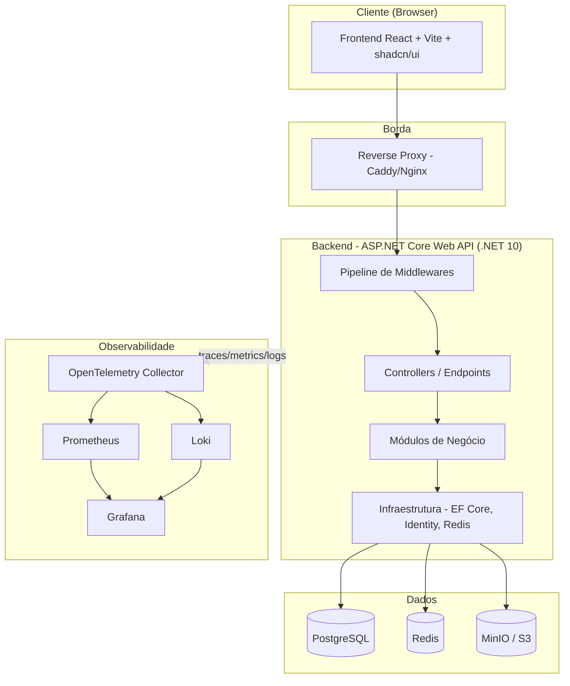
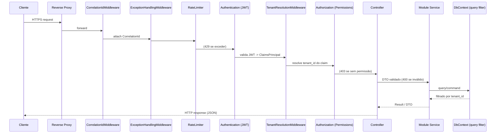
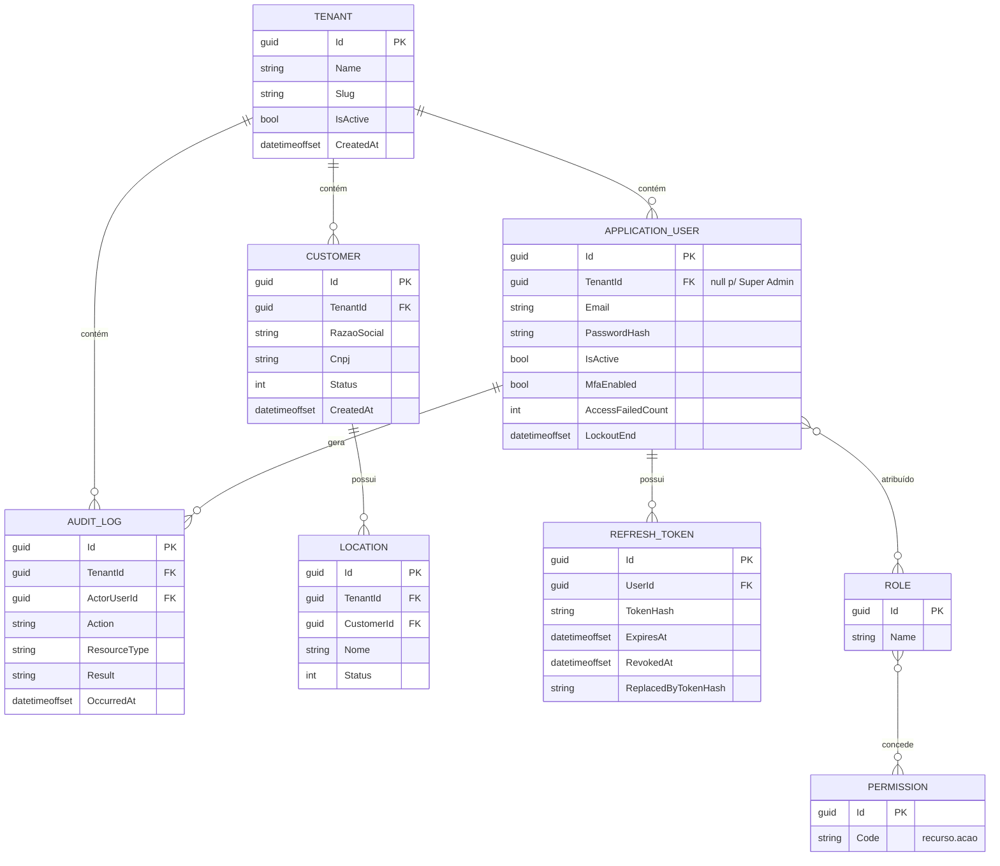

# Design Document — EasyPanel (FASE 1)

## Overview

Este documento descreve o design técnico da **Fase 1** do EasyPanel, a fundação da plataforma SaaS de gestão de outsourcing de impressão e ativos de TI. A Fase 1 entrega a infraestrutura base, autenticação, RBAC, isolamento multi-tenant, gestão de usuários e o CRUD de Clientes e Locais.

O design segue estritamente os requisitos de `requirements.md` e estabelece os padrões arquiteturais (monólito modular, isolamento de tenant no EF Core, contratos de API com DTOs, auditoria append-only, observabilidade) que serão reutilizados pelas fases subsequentes (impressoras, SNMP, contadores, suprimentos, estoque, alertas, chamados, contratos, fechamento, faturamento, dispositivos, relatórios, Windows Client, portal do cliente).

### Objetivos de design da Fase 1

- Estabelecer a **arquitetura de monólito modular** com fronteiras de módulo claras para futura extração em microsserviços.
- Garantir **isolamento multi-tenant** aplicado na camada de ORM (query filters globais) e validado no backend — nunca confiar no frontend.
- Implementar **autenticação** robusta (JWT curto + refresh token rotativo) com base preparada para MFA.
- Implementar **RBAC** com papéis e permissões granulares avaliados no backend.
- Prover **infraestrutura reproduzível** via Docker Compose, com health checks e migrações automáticas.
- Cobrir os requisitos não funcionais transversais: auditoria, rate limiting, logs JSON estruturados, paginação e indexação.

### Mapeamento de requisitos para componentes

| Requisito | Componente(s) de design principal |
|-----------|-----------------------------------|
| R1 Infraestrutura | Docker Compose, `HealthController`, `MigrationHostedService`, configuração por ambiente |
| R2 Autenticação | `AuthModule` (AuthService, TokenService, ASP.NET Identity) |
| R3 Recuperação/alteração de senha | `AuthModule` (PasswordService) |
| R4 Proteção contra abuso | `LoginAttemptTracker`, `RateLimitMiddleware` (rate limiting nativo .NET + Redis) |
| R5 RBAC | `AuthorizationModule` (permissões, `PermissionAuthorizationHandler`) |
| R6 Multi-tenant | `TenantModule` (`ITenantContext`, `TenantResolutionMiddleware`, EF global query filters) |
| R7 Gestão de usuários | `UserModule` (UserService, UsersController) |
| R8 Clientes | `CustomerModule` (CustomerService, CustomersController) |
| R9 Locais | `LocationModule` (LocationService, LocationsController) |
| R10 Auditoria | `AuditModule` (`IAuditLogger`, EF SaveChanges interceptor) |
| R11 Observabilidade | Serilog JSON + OpenTelemetry, `CorrelationIdMiddleware`, redaction |
| R12 Contrato de API/escala | DTOs + FluentValidation, `PagedResult<T>`, índices EF |

## Architecture

### Visão de alto nível



> **Escopo da Fase 1:** MinIO/S3 e a stack de observabilidade completa (Prometheus/Loki/Grafana) são provisionados no Docker Compose para estabelecer a fundação, mas o uso funcional de armazenamento de objetos (ex.: relatórios assíncronos) pertence a fases futuras. Na Fase 1, o storage é apenas provisionado e verificado por health check. SignalR e Hangfire **não** são exercitados funcionalmente na Fase 1 (não há requisito de tempo real ou jobs nesta fase); sua integração ocorre nas fases de monitoramento e relatórios.

### Estrutura de solução (monólito modular)

A solução .NET é organizada em projetos que refletem as fronteiras de módulo. Cada módulo de negócio expõe apenas contratos públicos (interfaces + DTOs) e mantém entidades/regras internas encapsuladas.

```
EasyPanel.sln
├── src/
│   ├── EasyPanel.Api/                  # Host Web API: Program.cs, controllers, middlewares, DI composition
│   ├── EasyPanel.Modules.Identity/     # Auth, Users, RBAC (ASP.NET Identity)
│   ├── EasyPanel.Modules.Tenancy/      # Tenant, ITenantContext, resolução e filtros
│   ├── EasyPanel.Modules.Customers/    # Customer + Location
│   ├── EasyPanel.Modules.Auditing/     # AuditLog
│   ├── EasyPanel.Shared.Kernel/        # Base entities, PagedResult, Result, exceptions, abstrações transversais
│   └── EasyPanel.Infrastructure/       # DbContext, EF config, Redis, Serilog, migrations, storage
├── tests/
│   ├── EasyPanel.UnitTests/
│   ├── EasyPanel.IntegrationTests/     # WebApplicationFactory + Testcontainers (PostgreSQL/Redis)
│   └── EasyPanel.SecurityTests/        # Testes de isolamento multi-tenant e autorização
├── frontend/                           # React + TypeScript + Vite + Tailwind + shadcn/ui
├── deploy/
│   ├── docker-compose.yml
│   ├── docker-compose.override.yml     # development
│   ├── docker-compose.staging.yml
│   ├── docker-compose.prod.yml
│   ├── Caddyfile
│   └── .env.example
└── docs/                               # ARCHITECTURE.md, DATABASE.md, API.md, SECURITY.md, DEPLOYMENT.md
```

**Regra de dependência:** `Api` → `Modules.*` → `Shared.Kernel`. `Infrastructure` implementa abstrações do Kernel e dos Módulos. Nenhum módulo de negócio referencia outro módulo diretamente; a comunicação entre módulos (quando necessária, ex.: Location referencia Customer) ocorre via contratos publicados no Kernel ou via IDs, evitando acoplamento de implementação.

### Pipeline de requisição (ordem de middlewares)



## Components and Interfaces

### 1. Módulo de Tenancy (R6)

O coração do isolamento. O `tenant_id` **nunca** vem do corpo/query da requisição; é sempre derivado do token autenticado.

```csharp
public interface ITenantContext
{
    Guid? TenantId { get; }        // null para contexto não autenticado ou Super Admin em endpoint admin
    bool IsSuperAdmin { get; }
    bool HasTenant { get; }
}

// Entidade base para todo dado de negócio isolado por tenant
public abstract class TenantEntity : BaseEntity
{
    public Guid TenantId { get; set; }
}

public abstract class BaseEntity
{
    public Guid Id { get; set; }
    public DateTimeOffset CreatedAt { get; set; }
    public DateTimeOffset? UpdatedAt { get; set; }
}
```

**Resolução do tenant (`TenantResolutionMiddleware`):** após a autenticação JWT, lê o claim `tenant_id` do `ClaimsPrincipal`, valida que é um GUID e popula um `TenantContext` scoped. Se o usuário for Super Admin acessando um endpoint administrativo designado, o tenant pode ser resolvido a partir de um cabeçalho/rota explícita (ex.: `X-Admin-Tenant-Id`) — apenas nesses endpoints (R6.7).

**Filtro global no EF Core:** aplicado a toda entidade que herda de `TenantEntity`.

```csharp
// No OnModelCreating, para cada entidade TenantEntity:
modelBuilder.Entity<Customer>()
    .HasQueryFilter(e => _tenantContext.TenantId != null && e.TenantId == _tenantContext.TenantId);
```

**Escrita segura:** um `SaveChanges` interceptor preenche `TenantId` em entidades `Added` a partir do `ITenantContext` e **rejeita** (lança `CrossTenantAccessException` → HTTP 404) qualquer entidade `Modified`/`Deleted` cujo `TenantId` divergir do contexto (R6.5, R6.6). Tentativas de acesso cruzado são auditadas (R6.9).

**Decisão de projeto — HTTP 404 em vez de 403 para acesso cross-tenant:** retornar 404 evita revelar a existência de recursos de outros tenants (previne enumeração), conforme R6.5.

### 2. Módulo de Identity — Autenticação (R2, R3, R4)

Baseado em **ASP.NET Core Identity** com `Guid` como chave, sobre PostgreSQL. Usuários são entidades de tenant (exceto Super Admin da plataforma).

```csharp
public class ApplicationUser : IdentityUser<Guid>
{
    public Guid? TenantId { get; set; }   // null apenas para Super Admin da plataforma
    public bool IsActive { get; set; }
    public bool MfaEnabled { get; set; }
    public DateTimeOffset CreatedAt { get; set; }
}

public interface IAuthService
{
    Task<Result<TokenPair>> LoginAsync(string email, string password, string? ip, CancellationToken ct);
    Task<Result<TokenPair>> RefreshAsync(string refreshToken, CancellationToken ct);
    Task<Result> LogoutAsync(string refreshToken, CancellationToken ct);
}

public interface ITokenService
{
    string CreateAccessToken(ApplicationUser user, IEnumerable<string> roles, IEnumerable<string> permissions);
    Task<RefreshToken> IssueRefreshTokenAsync(Guid userId, CancellationToken ct);
    Task<Result<RefreshToken>> ValidateAndRotateAsync(string token, CancellationToken ct);
    Task RevokeAllForUserAsync(Guid userId, CancellationToken ct);
}
```

**Tokens:**
- **JWT de acesso:** expiração ≤ 15 min (R2.6), assinado com chave simétrica/assimétrica de config. Claims: `sub`, `tenant_id`, `roles`, `permissions` (ou hash de versão de permissões para reduzir tamanho — ver decisão abaixo), `jti`.
- **Refresh token:** valor opaco aleatório (256 bits) armazenado **hasheado** no banco (`RefreshToken` entity: `TokenHash`, `UserId`, `ExpiresAt`, `RevokedAt`, `ReplacedByTokenHash`). Rotação a cada uso (R2.4); token antigo é revogado. Refresh inválido/expirado/revogado → 401 e exige novo login (R2.5).

**Política de senha (R3.7):** configurada via Identity `PasswordOptions` — mínimo 8 caracteres, exigindo maiúscula, minúscula, dígito e caractere especial. Hash via `PasswordHasher` do Identity (PBKDF2, resistente a força bruta — R2.8).

**MFA-ready (R2.9, R2.10):** o fluxo de login verifica `user.MfaEnabled`. Se falso, emite tokens direto. Se verdadeiro, retorna um estado `MfaRequired` com um `mfa_ticket` de curta duração; um segundo endpoint valida o fator (TOTP na implementação futura) e então emite os tokens. Na Fase 1 o caminho MFA existe estruturalmente mas nenhum usuário tem MFA habilitado por padrão, portanto o fluxo dos demais usuários não muda.

**Recuperação de senha (R3.1–R3.4):** token de uso único (hasheado no banco, validade ≤ 60 min). Resposta idêntica para email existente e inexistente (R3.2). Ao redefinir ou alterar senha, todos os refresh tokens do usuário são revogados (R3.4).

**Proteção contra força bruta (R4):**
- ASP.NET Identity lockout: `MaxFailedAccessAttempts = 5`, `DefaultLockoutTimeSpan = 15 min` (R4.3, R4.4). Sucesso zera o contador (R4.5).
- Toda tentativa de login registra resultado, horário e IP no AuditLog (R4.1).
- **Rate limiting** via middleware nativo de rate limiting do .NET com store distribuído no **Redis** (para funcionar com múltiplas instâncias). Políticas particionadas por usuário, IP, tenant e endpoint (R4.6). Exceder → 429 (R4.7).

**Decisão de projeto — permissions no JWT vs. lookup:** para evitar tokens grandes e permitir revogação rápida, o JWT carrega apenas `roles` e um `perm_version`. As permissões efetivas são resolvidas e cacheadas no Redis por role. Isso satisfaz R5.5 (mudança de papel reflete na próxima avaliação) sem exigir reemissão de token, pois o handler de autorização consulta o cache/DB por role a cada requisição autorizada. *(Alternativa considerada: embutir todas as permissões no JWT — rejeitada por dificultar revogação e inchar o token.)*

### 3. Módulo de Identity — Autorização/RBAC (R5)

Papéis fixos da Fase 1 (seed): Super Admin, Administrador, Financeiro, Operacional, Estoque, Técnico, Supervisor, Cliente. Permissões no formato `recurso.acao` (ex.: `customer.view`, `customer.create`, `location.edit`, `user.manage`).

```csharp
public sealed class Permissions
{
    public const string CustomerView = "customer.view";
    public const string CustomerCreate = "customer.create";
    public const string CustomerEdit = "customer.edit";
    public const string LocationView = "location.view";
    public const string LocationCreate = "location.create";
    public const string UserManage = "user.manage";
    // ... catálogo completo definido no seed
}

[AttributeUsage(AttributeTargets.Method | AttributeTargets.Class)]
public sealed class RequirePermissionAttribute : AuthorizeAttribute
{
    public RequirePermissionAttribute(string permission) => Policy = $"perm:{permission}";
}
```

Um `IAuthorizationPolicyProvider` dinâmico cria políticas `perm:<permission>` sob demanda, e um `PermissionAuthorizationHandler` verifica se algum papel do usuário concede a permissão (R5.3). Sem permissão → 403 (R5.4). A avaliação é sempre no backend (R5.6).

### 4. Módulo de Usuários (R7)

```csharp
public interface IUserService
{
    Task<Result<UserDto>> CreateAsync(CreateUserRequest req, CancellationToken ct);
    Task<Result<UserDto>> UpdateAsync(Guid id, UpdateUserRequest req, CancellationToken ct);
    Task<Result> DeactivateAsync(Guid id, CancellationToken ct);   // marca inativo + revoga refresh tokens
    Task<Result> ReactivateAsync(Guid id, CancellationToken ct);
    Task<Result<PagedResult<UserDto>>> ListAsync(UserQuery query, CancellationToken ct);
}
```

Criação vincula ao tenant do contexto (R7.1); email duplicado no mesmo tenant → 409 (R7.2). Desativação revoga refresh tokens e impede login enquanto inativo (R7.4, R7.5). Todas as mutações geram AuditLog (R7.8). Listagem retorna `PagedResult` filtrado por tenant (R7.7).

### 5. Módulo de Clientes e Locais (R8, R9)

```csharp
public class Customer : TenantEntity
{
    public string RazaoSocial { get; set; }
    public string? NomeFantasia { get; set; }
    public string Cnpj { get; set; }               // armazenado normalizado (somente dígitos)
    public string? InscricaoEstadual { get; set; }
    public string? Telefone { get; set; }
    public string? Email { get; set; }
    public string? Endereco { get; set; }
    public string? Cidade { get; set; }
    public string? Estado { get; set; }
    public string? Cep { get; set; }
    public string? Observacoes { get; set; }
    public CustomerStatus Status { get; set; }      // Ativo, Inativo, Bloqueado
    public ICollection<Location> Locations { get; set; } = new List<Location>();
}

public class Location : TenantEntity
{
    public Guid CustomerId { get; set; }
    public Customer Customer { get; set; }
    public string Nome { get; set; }
    public string? Endereco { get; set; }
    public string? Responsavel { get; set; }
    public string? Telefone { get; set; }
    public string? Email { get; set; }
    public string? Observacoes { get; set; }
    public LocationStatus Status { get; set; }
}
```

**Validação de CNPJ (R8.4):** FluentValidation com validador de dígitos verificadores de CNPJ; armazenamento normalizado (somente dígitos). Unicidade de CNPJ por tenant via índice único composto `(TenantId, Cnpj)` → conflito retorna 409 (R8.5).

**Vínculo Location→Customer (R9.3, R9.4):** ao criar um Location, o `CustomerId` é validado contra o tenant do contexto (o próprio query filter garante que Customer de outro tenant não seja encontrado → erro de validação/404). Relação 1:N Customer→Location com FK e índice `(TenantId, CustomerId)`.

### 6. Módulo de Auditoria (R10)

```csharp
public class AuditLog : TenantEntity   // TenantId pode ser derivado; para eventos de plataforma usa tenant do contexto
{
    public Guid? ActorUserId { get; set; }
    public string Action { get; set; }         // ex.: "user.create", "auth.login.failed"
    public string ResourceType { get; set; }
    public string? ResourceId { get; set; }
    public string? OldValues { get; set; }      // JSON, com redaction
    public string? NewValues { get; set; }      // JSON, com redaction
    public string? Ip { get; set; }
    public string? UserAgent { get; set; }
    public string Result { get; set; }          // success | denied | failure
    public DateTimeOffset OccurredAt { get; set; }
}

public interface IAuditLogger
{
    Task LogAsync(AuditEntry entry, CancellationToken ct);
}
```

`AuditLog` é **append-only** por convenção de negócio: nenhum serviço expõe update/delete (R10.4). Consulta paginada e filtrada por tenant (R10.5). Um interceptor de `SaveChanges` captura automaticamente mudanças em entidades sensíveis (usuários, papéis) e grava valores antigo/novo com redaction de campos sensíveis (R10.1).

### 7. Infraestrutura, Health e Migrações (R1, R11)

- **`HealthController`** expõe `/health/live` e `/health/ready`. O `ready` usa `IHealthCheck` para PostgreSQL, Redis e MinIO/S3; se qualquer dependência obrigatória falhar, reporta não saudável (R1.3, R1.5).
- **`MigrationHostedService`** (`IHostedService`) aplica migrações pendentes na inicialização antes de o host aceitar tráfego de negócio (R1.4). Em produção com múltiplas instâncias, protegido por advisory lock do PostgreSQL para evitar corrida.
- **Configuração** via `IConfiguration` a partir de variáveis de ambiente / arquivos `.env` por ambiente; segredos nunca commitados (R1.6).
- **Observabilidade (R11):** Serilog com sink JSON (compatível com Loki), enriquecido com `CorrelationId` e `tenant_id` (R11.3). Um `CorrelationIdMiddleware` gera/propaga o header `X-Correlation-Id`. Um `DestructuringPolicy`/enricher aplica **redaction** de senhas, tokens e segredos (R11.2). OpenTelemetry exporta traces e métricas ao Collector.
- **`ExceptionHandlingMiddleware`** converte exceções em respostas `ProblemDetails` (RFC 7807) sem vazar dados sensíveis e loga com contexto (R11.4).

### 8. Contrato de API e escala (R12)

- **DTOs** distintos das entidades (R12.1); mapeamento explícito (Mapster ou mapeamento manual).
- **Validação** via FluentValidation em pipeline; entrada inválida → 400 com detalhes (`ValidationProblemDetails`) (R12.2).
- **Paginação padronizada:**

```csharp
public sealed record PagedResult<T>(IReadOnlyList<T> Items, int Page, int PageSize, long TotalCount);
public sealed record PageRequest(int Page = 1, int PageSize = 25, string? Sort = null, string? Search = null);
```

`PageSize` limitado a no máximo 100 (R12.4). **Índices** sobre `TenantId` em todas as entidades de tenant e sobre campos de filtro/ordenação (R12.5).

### Endpoints da Fase 1 (REST, versionados `/api/v1`)

| Método | Rota | Permissão | Requisito |
|--------|------|-----------|-----------|
| POST | `/api/v1/auth/login` | anônimo | R2, R4 |
| POST | `/api/v1/auth/refresh` | anônimo (refresh token) | R2 |
| POST | `/api/v1/auth/logout` | autenticado | R2 |
| POST | `/api/v1/auth/forgot-password` | anônimo | R3 |
| POST | `/api/v1/auth/reset-password` | anônimo (reset token) | R3 |
| POST | `/api/v1/auth/change-password` | autenticado | R3 |
| GET | `/api/v1/users` | `user.manage` | R7 |
| POST | `/api/v1/users` | `user.manage` | R7 |
| PUT | `/api/v1/users/{id}` | `user.manage` | R7 |
| POST | `/api/v1/users/{id}/deactivate` | `user.manage` | R7 |
| POST | `/api/v1/users/{id}/reactivate` | `user.manage` | R7 |
| GET | `/api/v1/customers` | `customer.view` | R8 |
| POST | `/api/v1/customers` | `customer.create` | R8 |
| GET | `/api/v1/customers/{id}` | `customer.view` | R8 |
| PUT | `/api/v1/customers/{id}` | `customer.edit` | R8 |
| PATCH | `/api/v1/customers/{id}/status` | `customer.edit` | R8 |
| GET | `/api/v1/customers/{customerId}/locations` | `location.view` | R9 |
| POST | `/api/v1/locations` | `location.create` | R9 |
| GET | `/api/v1/locations/{id}` | `location.view` | R9 |
| PUT | `/api/v1/locations/{id}` | `location.edit` | R9 |
| PATCH | `/api/v1/locations/{id}/status` | `location.edit` | R9 |
| GET | `/api/v1/audit-logs` | `audit.view` | R10 |
| GET | `/health/live`, `/health/ready` | anônimo | R1 |

Documentação via **Swagger/OpenAPI** com esquema de segurança Bearer.

## Data Models

### Modelo ER (Fase 1)



### Índices principais

| Tabela | Índice | Motivo |
|--------|--------|--------|
| Customer | `(TenantId)`, `UNIQUE (TenantId, Cnpj)`, `(TenantId, Status)`, `(TenantId, RazaoSocial)` | isolamento, unicidade, filtros/ordenação |
| Location | `(TenantId)`, `(TenantId, CustomerId)`, `(TenantId, Status)` | isolamento e listagem por cliente |
| ApplicationUser | `UNIQUE (TenantId, NormalizedEmail)`, `(TenantId)` | unicidade por tenant, isolamento |
| RefreshToken | `UNIQUE (TokenHash)`, `(UserId)`, `(ExpiresAt)` | validação e limpeza |
| AuditLog | `(TenantId, OccurredAt DESC)`, `(TenantId, ResourceType)` | consulta paginada por período |

### Estratégia de tipos

- Chaves primárias: `Guid` (v7/sequential onde possível, para localidade de índice).
- Timestamps: `DateTimeOffset` em UTC.
- Status: enums persistidos como `int`.
- CNPJ: `varchar(14)` normalizado (somente dígitos).

## Error Handling

Todas as respostas de erro seguem **RFC 7807 (`ProblemDetails`)**, produzidas centralmente pelo `ExceptionHandlingMiddleware`.

| Situação | Exceção | HTTP | Corpo |
|----------|---------|------|-------|
| Validação de DTO | `ValidationException` | 400 | `ValidationProblemDetails` com erros por campo |
| Não autenticado / token inválido/expirado | (auth) | 401 | ProblemDetails genérico |
| Sem permissão | `ForbiddenException` | 403 | ProblemDetails genérico |
| Recurso não encontrado / cross-tenant | `NotFoundException` / `CrossTenantAccessException` | 404 | ProblemDetails genérico (não revela existência) |
| Conflito (CNPJ/email duplicado) | `ConflictException` | 409 | ProblemDetails com código |
| Rate limit excedido | (rate limiter) | 429 | ProblemDetails + header `Retry-After` |
| Erro inesperado | qualquer | 500 | ProblemDetails genérico; detalhe apenas em log |

**Padrão Result:** serviços de domínio retornam `Result`/`Result<T>` para erros esperados (validação de negócio, conflito), evitando exceções para fluxo de controle. Exceções são reservadas para condições excepcionais e traduzidas pelo middleware. Credenciais inválidas retornam mensagem genérica (R2.2), e recuperação de senha responde igual para email existente/inexistente (R3.2).

## Testing Strategy

Seguindo R6.8 e a seção de testes do escopo do produto, com foco em segurança e isolamento.

### Unit Tests (`EasyPanel.UnitTests`)
- Política e hashing de senha; validação de CNPJ (dígitos verificadores).
- Lógica de rotação/revogação de refresh token.
- `PermissionAuthorizationHandler`: concede/nega conforme papéis.
- Regras de status de Customer/Location.

### Integration Tests (`EasyPanel.IntegrationTests`)
- `WebApplicationFactory` + **Testcontainers** (PostgreSQL e Redis reais em contêiner) para exercitar o pipeline completo.
- Fluxos de auth: login sucesso/falha, lockout após 5 falhas, refresh com rotação, refresh inválido → 401, change/reset password revoga tokens.
- CRUD de Customer/Location: criação, conflito de CNPJ (409), validação de CNPJ (400), paginação (limite 100).
- Health checks: `ready` falha quando dependência indisponível.
- Migrações aplicadas na inicialização.

### Security / Multi-Tenant Tests (`EasyPanel.SecurityTests`)
- **Isolamento (R6.8):** usuário do Tenant A não lê/edita/exclui recursos do Tenant B → 404; tentativa gera AuditLog (R6.9).
- Query filter global aplicado em list, get, update e delete.
- Autorização: acesso a endpoint sem permissão → 403.
- Rate limiting: exceder política → 429.
- Verificação de que logs não contêm senhas/tokens (redaction).

### Critérios de qualidade
- CI executa build + testes; falha em teste crítico (isolamento, auth, validação financeira futura) **bloqueia** o merge/deploy.
- Cobertura priorizada em auth, autorização e isolamento de tenant.

## Correctness Properties

Propriedades invariantes que devem valer em qualquer estado do sistema. Servem de base para testes baseados em propriedades e revisões de segurança.

#### Property 1: Isolamento de tenant (invariante crítico)
Para qualquer requisição autenticada com contexto de tenant `T`, nenhuma operação de leitura ou escrita pode observar ou modificar uma entidade cujo `TenantId ≠ T`. Toda consulta a `TenantEntity` é filtrada por `TenantId`, e toda escrita valida `TenantId` antes de persistir. (R6)

#### Property 2: Origem do tenant
O `tenant_id` efetivo de uma requisição é sempre derivado do token autenticado (ou do endpoint admin designado para Super Admin), nunca de entrada fornecida pelo cliente. (R6.3, R6.7)

#### Property 3: Monotonicidade de revogação
Um refresh token, uma vez revogado (por rotação, logout, troca de senha ou desativação), nunca volta a ser válido. (R2.5, R3.4, R7.4)

#### Property 4: Autorização positiva
Uma operação protegida só é executada se o conjunto de permissões efetivas do usuário contiver a permissão exigida; na ausência, a operação não produz efeito e retorna 403. (R5.3, R5.4)

#### Property 5: Não-vazamento de existência
Respostas de erro para recursos inexistentes e para recursos de outro tenant são indistinguíveis (ambas 404), e respostas de credenciais inválidas e de recuperação de senha não revelam existência de conta. (R2.2, R3.2, R6.5)

#### Property 6: Unicidade por tenant
Não existem dois Customers com o mesmo CNPJ dentro do mesmo tenant, nem dois usuários com o mesmo email dentro do mesmo tenant. (R8.5, R7.2)

#### Property 7: Consistência de status
O status de um Customer pertence sempre a {Ativo, Inativo, Bloqueado} e o de um Location a um conjunto fechado análogo; nenhuma transição produz estado fora do domínio. (R8.3)

#### Property 8: Append-only da auditoria
O conjunto de registros de AuditLog é monotonicamente crescente; nenhuma operação de negócio altera ou remove registros existentes. (R10.4)

#### Property 9: Ausência de segredos em logs
Nenhum registro de log contém senha, token, segredo ou credencial em texto claro, em qualquer caminho de execução (sucesso ou erro). (R11.2)

#### Property 10: Limite de página
Toda resposta de listagem contém no máximo 100 itens, independentemente do `PageSize` solicitado. (R12.4)

#### Property 11: Terminação do login
Para qualquer sequência de tentativas de login de um usuário, após 5 falhas consecutivas o sistema entra em estado de bloqueio por 15 minutos, e um sucesso zera o contador. (R4.3, R4.5)

## Deployment & Infraestrutura (R1)

**Docker Compose** com serviços: `api`, `postgres`, `redis`, `minio`, `caddy` (reverse proxy), `otel-collector`, `prometheus`, `loki`, `grafana`, e `frontend` (build estático servido pelo proxy). Overrides por ambiente: `development`, `staging`, `production`.

- **Reverse proxy (Caddy)** termina TLS e roteia `/api/*` para o backend e o restante para o frontend (R1.7). HTTPS automático em staging/prod.
- **Migrações** aplicadas pelo `MigrationHostedService` na subida do `api` (R1.4).
- **Segredos** injetados via variáveis de ambiente / `.env` não versionado (R1.6).
- **Backups** (documentados em `DEPLOYMENT.md`): dump diário do PostgreSQL com retenção configurável; versionamento no MinIO. *(Automação de backup é infraestrutural; a Fase 1 documenta o procedimento e provisiona os volumes.)*

## Decisões arquiteturais e itens sinalizados

1. **Isolamento por query filter + interceptor**, não por schema/banco separado por tenant. Escolhido por simplicidade operacional e escala (milhares de tenants numa mesma instância), mantendo a porta aberta para particionamento futuro. *Sinalizado:* particionamento físico por tenant não faz parte da Fase 1.
2. **Refresh token opaco hasheado com rotação**, em vez de JWT de refresh, para permitir revogação imediata.
3. **Permissões resolvidas por role via cache Redis**, não embutidas integralmente no JWT, para revogação rápida e tokens enxutos.
4. **MFA estruturalmente presente, funcionalmente inativo** na Fase 1 (nenhum provedor TOTP implementado ainda) — conforme requisito "MFA preparado". *Sinalizado como preparação, não funcionalidade completa.*
5. **SignalR, Hangfire, MinIO funcional e observabilidade completa** são **provisionados** na infraestrutura da Fase 1 mas **não exercitados funcionalmente** — pertencem às fases de monitoramento, relatórios e hardening. *Sinalizado.*
6. **Nenhum dado fake no produto final:** seeds da Fase 1 limitam-se a papéis, permissões e (opcionalmente) um tenant + Super Admin inicial para bootstrap/onboarding; nenhum dado de negócio fictício.
